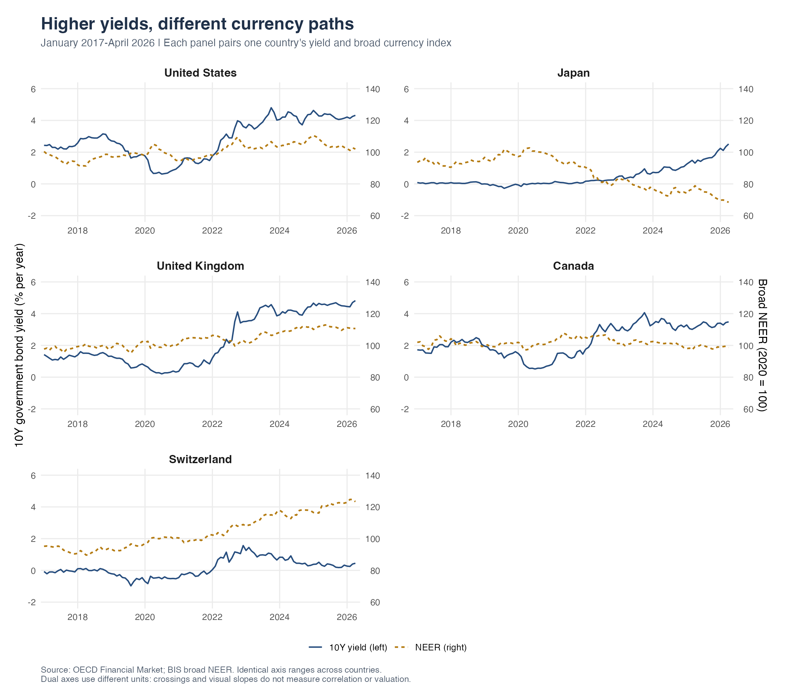
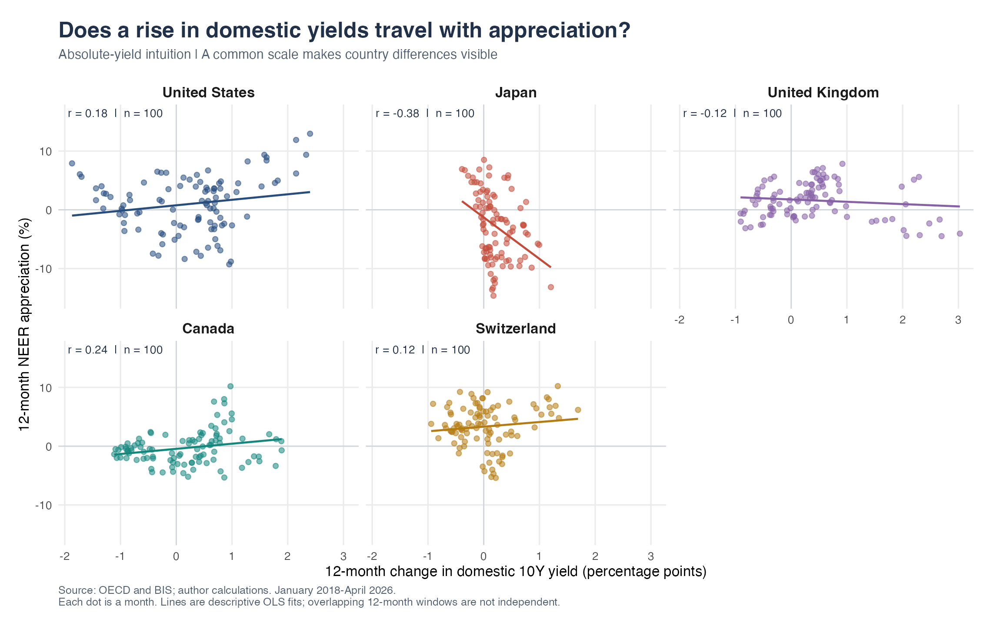
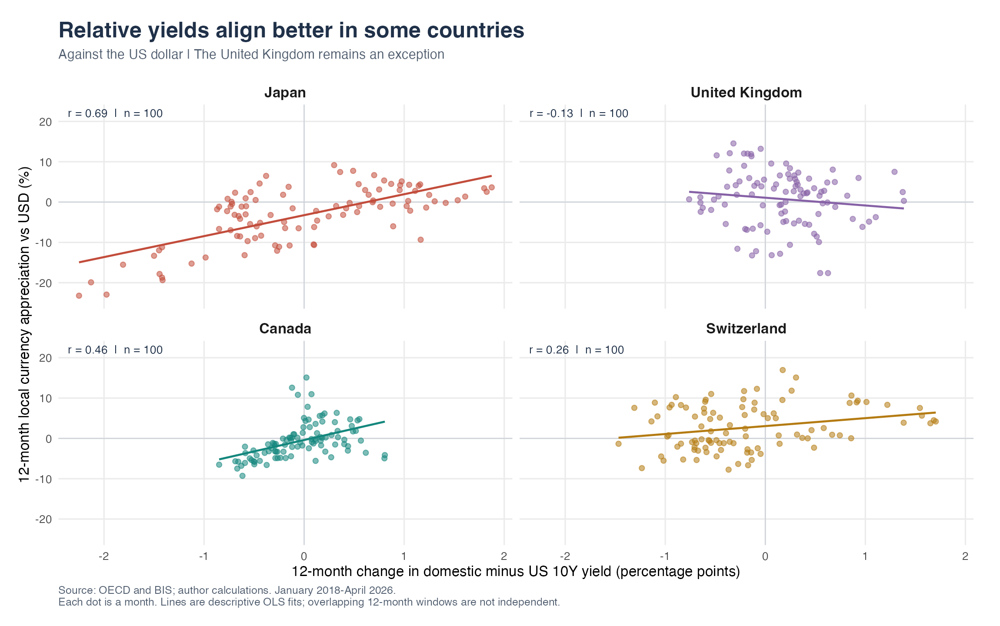

```{r}
#| include: false
source('R/02_clean.R')
source('R/03_figures.R')
r <- function(c, col) sprintf('%.2f',stats[[col]][match(c,stats$country)])
```

{fig-alt="Pastel illustration of a smiling bond certificate and currency coins, connected by yield curves and a question mark."}

In a volatile world, investors may seek the predictable income of government bonds. Higher yields can make those bonds look more attractive. Overseas investors buying unhedged foreign bonds also need the local currency, potentially increasing demand for it. This raises a natural question: **can more attractive government bond yields help strengthen a currency, or is the yield advantage over other countries what really matters?** Exchange-rate losses can offset bond income, making this distinction important for international investors.

## Do yields and currencies move together?

First, do the country-level paths reveal a clear relationship? I combine [OECD Financial Market](https://data-explorer.oecd.org/) yields with [BIS broad nominal effective exchange rates](https://data.bis.org/topics/EER) (NEER) and [BIS bilateral exchange rates](https://data.bis.org/topics/XRU) for the United States, Japan, United Kingdom, Canada, and Switzerland, monthly from January 2017 through April 2026.

OECD's [long-term rate indicator](https://www.oecd.org/en/data/indicators/long-term-interest-rates.html) represents benchmark ten-year government yields, in percent per year. NEER measures a currency against a trade-weighted basket: a rising index means appreciation, with 2020 averaging 100. BIS bilateral rates measure local currency units per US dollar; a falling number means the local currency strengthens against the dollar.

{#fig-overview fig-alt="Five separate country panels, each pairing its government bond yield and broad nominal effective exchange rate on dual axes, January 2017 to April 2026."}

@fig-overview reveals no obvious common pattern. US yields and dollar strength sometimes move together, suggesting the proposed relationship. Japan often shows the opposite: yields rise while its currency weakens. Canada, the United Kingdom, and Switzerland show less consistent alignment. These paths cannot establish a general correlation, and dual-axis slopes depend on scaling. We therefore need to compare changes systematically.

## Do rising domestic yields accompany appreciation?

Next, does a rise in a country's own yield coincide with currency appreciation over the same year? I calculate the twelve-month yield change, $y_t-y_{t-12}$, in percentage points; a positive value means the bond now offers a higher yield. NEER appreciation, $100(N_t/N_{t-12}-1)$, measures the percentage strengthening or weakening against the currency basket over that year. Positive values mean appreciation. The transformations leave 100 monthly observations per country, January 2018–April 2026.

{#fig-absolute fig-alt="Five scatterplot panels of twelve-month domestic yield changes against NEER appreciation, with country-specific correlations."}

@fig-absolute shows weak positive correlations in Canada (`r r('Canada','r_absolute_neer')`), the United States (`r r('United States','r_absolute_neer')`), and Switzerland (`r r('Switzerland','r_absolute_neer')`), but negative ones in Japan (`r r('Japan','r_absolute_neer')`) and Britain (`r r('United Kingdom','r_absolute_neer')`). Rising domestic yields alone do not consistently accompany stronger currencies. Could investors instead respond to how yields compare with alternatives abroad? I next use US Treasuries as the benchmark.

## Does the yield advantage over the US matter more?

Does an improving yield advantage over US Treasuries align more closely with appreciation against the dollar? I calculate the domestic-minus-US yield spread and its twelve-month change; a positive change means the domestic yield becomes more attractive relative to the US yield. Dollar appreciation is $100(E_{t-12}/E_t-1)$, using monthly-average rates. Because $E$ is local currency per dollar, the ratio is reversed so that a stronger local currency produces a positive return.

{#fig-relative fig-alt="Four scatterplot panels showing positive relative-yield correlations in Japan, Canada and Switzerland, and a weak negative relationship in the United Kingdom."}

@fig-relative shows upward-sloping relationships for Japan (`r r('Japan','r_relative_usd')`), Canada (`r r('Canada','r_relative_usd')`), and Switzerland (`r r('Switzerland','r_relative_usd')`). The pattern is clearest in Japan, moderate in Canada, and weaker in Switzerland. Britain remains an exception, with a slight negative relationship (`r r('United Kingdom','r_relative_usd')`).

To compare absolute and relative yields more clearly, the table places their correlations with currency strength side by side, using the same measure of appreciation against the dollar and the same 100 months. Yield-spread changes show a stronger positive correlation in Japan and Canada, while Switzerland shifts from a negative to a positive relationship. Britain remains slightly negative. Overall, yield-spread changes are more positively associated with currency appreciation than domestic yield changes, but this positive relationship is not universal.

```{r}
#| label: tbl-comparison
#| tbl-cap: "Correlation with appreciation against USD: same outcome and same 100 months."
stats |> filter(country!='United States') |>
 select(Country=country,`Domestic yield change`=r_absolute_usd,`Yield-spread change`=r_relative_usd) |>
 knitr::kable(digits=2)
```

## What is the answer for investors?

**More attractive domestic yields do not consistently accompany stronger currencies; the yield advantage abroad helps explain some country patterns, but supplies no universal rule.** Domestic yield changes align weakly with appreciation in the US and Canada, while Japan and Britain show negative relationships. Relative yields reveal positive relationships in Japan, Canada, and Switzerland, yet Britain remains negative. Each country has its own pattern. Investors should therefore consider not only higher yields but also potential losses from exchange-rate movements and the costs of currency conversion or hedging.

These contemporaneous associations do not establish that yields caused capital inflows. Inflation expectations, policy surprises, risk premia, and hedging also matter.

::: {.source-note}
**Sources and replication.** Data come from OECD Financial Market and BIS exchange-rate datasets. The R scripts for downloading, cleaning, and plotting the data, together with the archived data and replication instructions, are available in the [GitHub repository](https://github.com/xia071212/blog4repo). See the [README](https://github.com/xia071212/blog4repo#readme) to reproduce the figures and results.
:::
